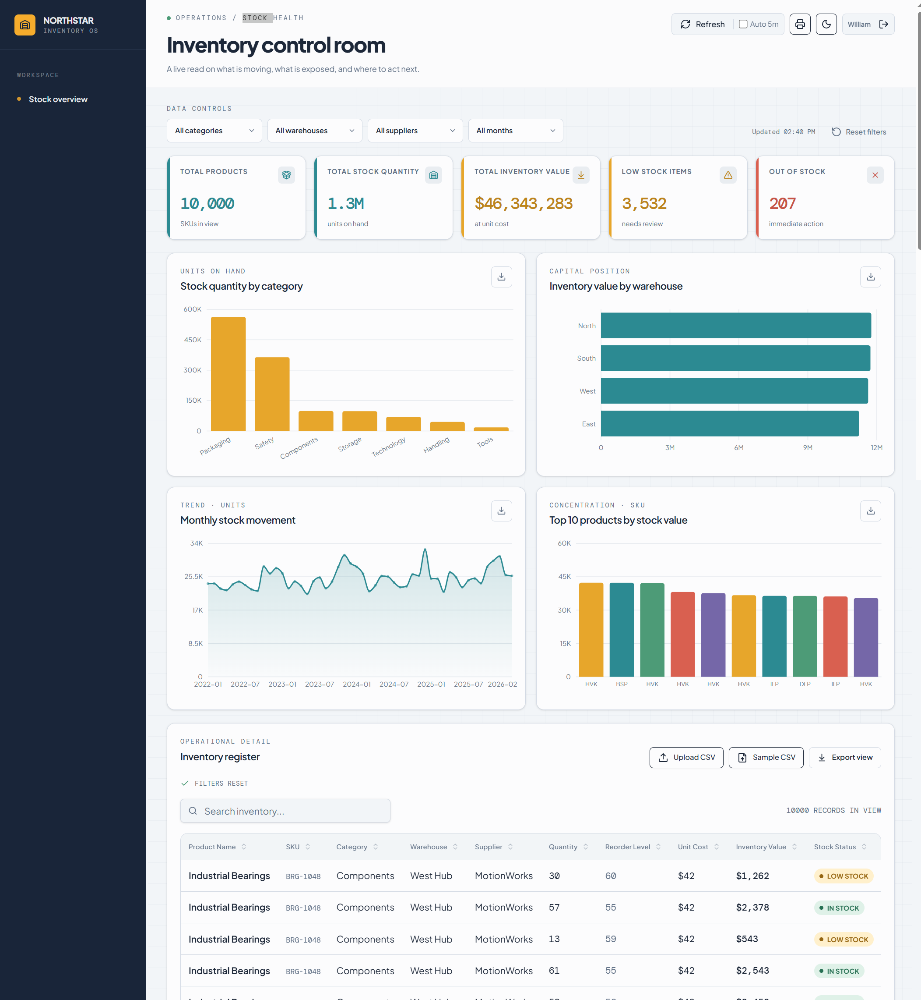

# Inventory Control Room — Northstar Inventory OS

## Project Overview
Inventory Control Room is a live operations dashboard that gives a single, real-time view of stock health across 4 warehouses. It tracks quantity on hand, inventory value, and reorder risk for 50 products (10,000 historical records spanning Jan 2022 – Feb 2026), so operators can see what's moving, what's exposed, and where to act next — without digging through spreadsheets.

## Business Problem
Stock data was scattered across warehouses with no unified view, making it hard to answer basic operational questions: which SKUs are at risk of stocking out, which warehouses are carrying the most capital in inventory, and how demand is trending month to month. This dashboard was built to surface that risk in one place and flag items that need immediate reordering action.

## Dataset
- **Source:** Internal inventory records (`inventory_10000.csv`)
- **Size:** 10,000 rows × 9 columns — 50 unique products tracked monthly across 4 warehouses from January 2022 to February 2026 (50 months)
- **Fields:** Product Name, SKU, Category (7: Packaging, Safety, Components, Storage, Technology, Material Handling, Tools), Warehouse (North/South/East/West Hub), Supplier (7 suppliers), Quantity, Reorder Level, Unit Cost, Month
- **Quality:** No missing values, no duplicate rows, no negative quantities — dataset required no repair before analysis

## Tools Used
- **Replit** — development environment and hosting for the live dashboard
- **CSV-based data pipeline** — upload/sample/export built directly into the dashboard's Inventory Register
- Charting for category, warehouse, and trend visualizations, with light/dark mode and auto-refresh

## Data Cleaning
The raw CSV was already complete and consistent (verified: 0 nulls across all 9 fields, 0 duplicate rows, 0 negative quantities, uniform `YYYY-MM` date formatting). Cleaning work focused on deriving an **Inventory Value** field (`Quantity × Unit Cost`) per row, standardizing category/warehouse labels for grouping, and computing a low-stock status flag (`Quantity ≤ Reorder Level`) and out-of-stock flag (`Quantity = 0`) for the register view.

## Analysis
Working from the full 50-month dataset, the analysis rolled up quantity and value by category, warehouse, and product, tracked total monthly stock movement over time, and flagged every row against its reorder threshold to quantify low-stock and stockout exposure. Top-10 products by cumulative inventory value were isolated to identify capital concentration.

## Key Findings
- **Packaging and Safety dominate volume**: Packaging (563,015 units) and Safety (363,857 units) together account for the large majority of units on hand — over 6x the next-largest category (Components, 98,689 units).
- **3,532 low-stock records and 207 stockouts** across the full history — a meaningful share of all 10,000 inventory-month records carry reorder risk.
- **Components, Material Handling, and Tools run leanest relative to their reorder point** (average quantity is only 0.86–1.33x reorder level), while Packaging and Technology are comfortably overstocked (2.4–2.5x reorder level) — the risk isn't evenly spread.
- **South Hub carries the most stockout events** (60 of 207) despite North Hub holding the highest inventory value ($11.76M) — value and risk aren't concentrated in the same place.
- **Hydraulic Valve Kit ($3.85M) and Barcode Scanner Pro ($3.07M)** are the two largest capital positions, together over $6.9M — roughly 15% of total inventory value sits in just 2 of the 50 SKUs.
- **Monthly stock quantity has trended upward**, from ~23,750 units in Jan 2022 to a peak of ~32,432 units (Dec 2025), before dipping to ~25,723 in the latest month (Feb 2026).
- **ScanLogic is the largest supplier by value** ($11.7M), roughly on par with the entire North Hub warehouse's holdings — a notable single-supplier concentration.

## Recommendations
- **Prioritize reorder review for Components, Material Handling, and Tools** — these categories run closest to (or below) their reorder points and are most exposed to stockouts.
- **Investigate South Hub's fulfillment or replenishment process** — it has the most stockout incidents despite not holding the most inventory value, suggesting a process or lead-time issue rather than a stocking-level issue.
- **Set tighter monitoring on the top 2–3 SKUs by value** (Hydraulic Valve Kit, Barcode Scanner Pro, Electric Pallet Truck) — a stockout or write-down on any of these has outsized impact on total inventory value.
- **Review supplier concentration risk with ScanLogic** — nearly a quarter of total inventory value flows through one supplier; a backup source may be worth qualifying.
- **Reassess Packaging/Technology reorder levels** — both run at 2.4–2.5x their reorder threshold on average, which may indicate over-ordering and tied-up capital that could be trimmed.

## Dashboard / Project Link
🔗https://supply-chain-inventory-dashboard--mwatigaturu.replit.app/admin
---
*Built by [William Gaturu — [August/2026]*
